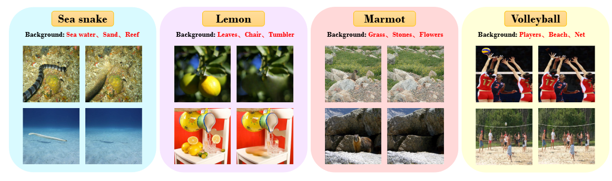

# Overcoming Shortcut Problem in VLM for Robust Out-of-Distribution Detection

The code repository for "[Overcoming Shortcut Problem in VLM for Robust Out-of-Distribution Detection](https://www.kaggle.com/datasets/xiangexiang/imagenet-bg-ospcoop-cvpr2025)" in PyTorch. 
    
## News

[03/2025]🎉  We have released the proposed "[ImageNet-Bg]".

[02/2025]🎉  Our paper has been accepted by CVPR2025.

## The proposed ImageNet-Bg

To further test the robustness of the model against background interference, we propose an ImageNet background interference test set, ImageNet-Bg, based on the ImageNet validation set with 48,285 images. All images in this dataset are generated by removing ID-relevant regions from samples in the ImageNet validation set. We filter the images to obtain the ImageNet-Bg(S) test set, which contains purer background information with 24,863 images. 

## Pseudo-OOD Generation

### Image Masking

### Image Inpainting
